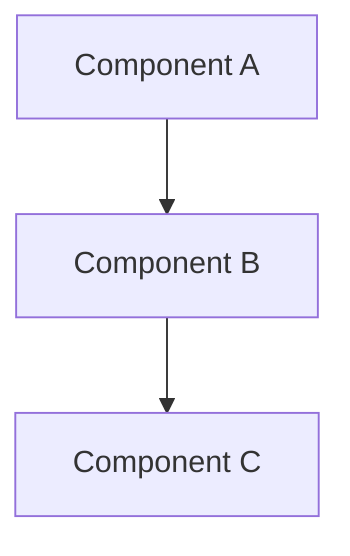
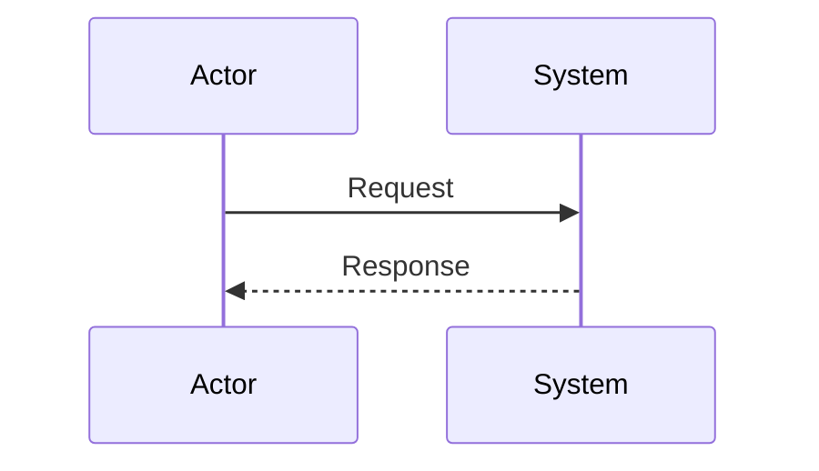

# [Feature/System Name] Design Document

| Field | Value |
|-------|-------|
| **Author(s)** | [Name(s)] |
| **Status** | Draft / In Review / Approved / Implemented / Deprecated |
| **Created** | YYYY-MM-DD |
| **Last Updated** | YYYY-MM-DD |
| **Reviewers** | [Names] |
| **Approvers** | [Names] |
| **Related Docs** | [Links to PRDs, ADRs, etc.] |

---

## TL;DR

_One paragraph summary of what this document proposes and why it matters._

---

## Context and Background

_What is the current state? What problem exists? Why is this work necessary now?_

### Problem Statement

_Clearly articulate the problem being solved._

### Current State

_Describe the existing system/process if applicable._

---

## Goals

_What does success look like? Use measurable outcomes where possible._

| ID | Goal | Success Metric |
|----|------|----------------|
| G1 | | |
| G2 | | |
| G3 | | |

## Non-Goals

_What is explicitly out of scope? Being clear about non-goals prevents scope creep._

- NG1:
- NG2:

---

## Proposed Design

### Architecture Overview

_High-level architecture diagram and explanation._



### Core Components

#### Component 1: [Name]

**Responsibility:** _What does this component do?_

**Interface:**
```typescript
// Key interfaces/types
```

**Key Behaviors:**
-

#### Component 2: [Name]

_Repeat for each major component._

### Data Model

_Key data structures, database schemas, or state management._

```typescript
// Data models
```

### API Design

_Key endpoints, RPC methods, or CLI commands._

| Endpoint/Command | Method | Description |
|------------------|--------|-------------|
| | | |

### Sequence Diagrams

_Show key flows through the system._



---

## Trade-offs and Alternatives Considered

### Option 1: [Chosen Approach]

**Pros:**
-

**Cons:**
-

### Option 2: [Alternative]

**Pros:**
-

**Cons:**
-

**Why Option 1 was chosen:** _Rationale for the decision._

---

## Cross-Cutting Concerns

### Scalability

_How does this design scale? What are the bottlenecks?_

### Security

_Authentication, authorization, data protection considerations._

### Privacy and Compliance

_GDPR, CCPA, platform ToS compliance._

### Observability

_Logging, metrics, tracing, alerting._

### Performance

_Latency targets, throughput requirements, resource constraints._

---

## Risks and Mitigations

| Risk | Likelihood | Impact | Mitigation |
|------|------------|--------|------------|
| | Low/Medium/High | Low/Medium/High | |

---

## Dependencies

_External services, libraries, teams, or systems this depends on._

| Dependency | Type | Risk Level | Notes |
|------------|------|------------|-------|
| | Service/Library/Team | Low/Medium/High | |

---

## Rollout Plan

### Phase 1: [Name]

- **Scope:**
- **Timeline:**
- **Success Criteria:**

### Phase 2: [Name]

_Continue for additional phases._

### Rollback Plan

_How do we revert if something goes wrong?_

---

## Test Plan

### Unit Tests

_What unit tests will be added?_

### Integration Tests

_What integration tests will be added?_

### E2E Tests

_What end-to-end tests will be added?_

### Manual Testing

_What manual testing is required?_

---

## Open Questions

- [ ] Question 1?
- [ ] Question 2?

---

## Document History

| Date | Author | Changes |
|------|--------|---------|
| YYYY-MM-DD | [Name] | Initial draft |

---

## Appendices

### Appendix A: [Title]

_Additional details, research, or reference material._

---

## Usage Notes

### When to Write a Design Doc

Write a design doc when:
- Building a new feature or system
- Making significant architectural changes
- The implementation will take more than a few days
- Multiple people need to understand and agree on the approach
- The decision has long-term implications

### Tips for Writing Good Design Docs

1. **Write early:** Before implementation, not after
2. **Be concise:** As short as possible, as long as necessary
3. **Use diagrams:** A picture is worth a thousand words
4. **Document rationale:** The "why" is as important as the "what"
5. **Include trade-offs:** Show you considered alternatives
6. **Get feedback:** Share drafts early with stakeholders
7. **Keep it updated:** Treat as a living document during implementation

### Document Types

| Type | Purpose | When to Use |
|------|---------|-------------|
| **PRD** | Product requirements | Starting a new product/feature |
| **RFC** | Request for Comments | Proposing changes that need peer feedback |
| **ADR** | Architecture Decision Record | Recording individual significant decisions |
| **TDD** | Technical Design Doc | Detailed implementation blueprint |
| **CWD** | Current Working Design | Living master design document |
