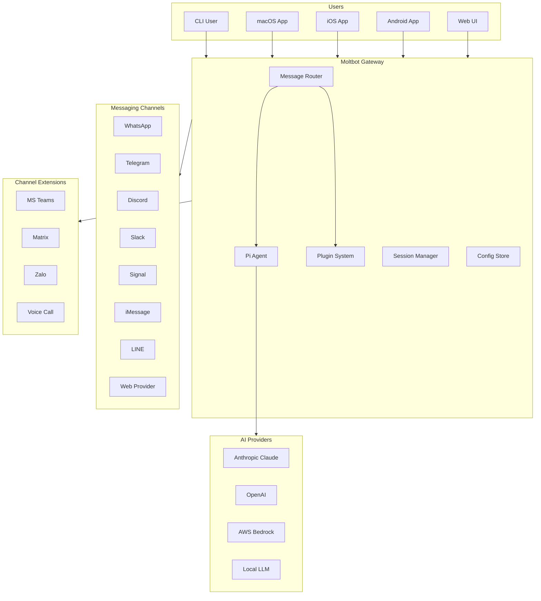

# Moltbot Current Working Design

| Field | Value |
|-------|-------|
| **Author(s)** | Moltbot Team |
| **Status** | Living Document |
| **Created** | 2026-01-29 |
| **Last Updated** | 2026-02-02 |
| **Related Docs** | [README](../README.md), [Docs](https://docs.molt.bot) |

---

## TL;DR

Moltbot is a unified messaging gateway with AI agent capabilities. It provides a single CLI and native apps (macOS, iOS, Android) to manage multiple messaging platforms (WhatsApp, Telegram, Discord, Slack, Signal, iMessage, and more) while enabling AI-powered automation through the Pi agent system. The system serves both technical users (CLI) and non-technical users (native apps).

---

## Scope and Goals

| ID | Goal | Success Metric |
|----|------|----------------|
| G1 | Unified multi-channel messaging | Support 6+ messaging platforms through single interface |
| G2 | AI-powered message handling | Pi agent responds intelligently to messages with tool use |
| G3 | Cross-platform native experience | Native apps for macOS, iOS, Android with shared core |
| G4 | Developer-friendly CLI | Full functionality accessible via `moltbot` CLI commands |
| G5 | Extensible architecture | Plugin system for custom channels and integrations |
| G6 | Privacy-first design | Local-first processing, user controls data |

## Non-Goals

- NG1: Building a social network or message storage service
- NG2: Replacing native messaging apps for daily use
- NG3: Supporting platforms without official or unofficial APIs
- NG4: Enterprise multi-tenant SaaS deployment (focus is personal/small team use)

---

## Decisions Log

| ID | Decision | Rationale | Date |
|----|----------|-----------|------|
| D1 | TypeScript + ESM for core | Type safety, ecosystem, cross-platform Node runtime | - |
| D2 | Baileys for WhatsApp | Best maintained unofficial WhatsApp Web library | - |
| D3 | Grammy for Telegram | Modern, well-typed Telegram bot framework | - |
| D4 | Pi agent architecture | Flexible tool-use AI agent with coding capabilities | - |
| D5 | Native apps via Swift/Kotlin | Best UX for each platform, shared protocol | - |
| D6 | Plugin system with jiti | Dynamic loading without compilation, hot reload support | - |
| D7 | SQLite + sqlite-vec for storage | Local-first, embeddings support, no server needed | - |

---

## System Architecture



---

## Core Components

### Gateway (`src/gateway/`)

**Responsibility:** Central orchestration layer that manages channel connections, message routing, and agent invocation.

**Key Behaviors:**
- Starts/stops channel connections
- Routes incoming messages to appropriate handlers
- Manages WebSocket connections for native apps
- Handles graceful shutdown and reconnection

### Message Router (`src/routing/`)

**Responsibility:** Routes messages between channels and determines which handler processes each message.

**Key Behaviors:**
- Allowlist/blocklist filtering
- Channel-specific routing rules
- Message deduplication
- Rate limiting per channel

### Pi Agent (`src/agents/`)

**Responsibility:** AI-powered message handling with tool use capabilities.

**Key Behaviors:**
- Processes natural language messages
- Invokes tools (code execution, web search, file operations)
- Maintains conversation context
- Supports multiple AI providers

### Channel Adapters (`src/telegram/`, `src/discord/`, etc.)

**Responsibility:** Platform-specific message handling and API integration.

**Interface Pattern:**
```typescript
interface ChannelAdapter {
  connect(): Promise<void>
  disconnect(): Promise<void>
  sendMessage(chatId: string, content: MessageContent): Promise<void>
  onMessage(handler: MessageHandler): void
}
```

### Plugin System (`src/plugins/`)

**Responsibility:** Dynamic loading of channel extensions and custom integrations.

**Key Behaviors:**
- Discovers plugins in `extensions/` directory
- Loads via jiti for TypeScript support
- Provides SDK for plugin development (`moltbot/plugin-sdk`)
- Manages plugin lifecycle

### Native App Protocol (`apps/macos/`, `apps/ios/`, `apps/android/`)

**Responsibility:** Native UI experiences with shared gateway communication protocol.

**Protocol:** JSON-RPC over WebSocket, schema at `dist/protocol.schema.json`

---

## Data Model

### Configuration (`~/.clawdbot/config.json`)

```typescript
interface Config {
  gateway: {
    mode: 'local' | 'remote'
    port: number
    bind: 'loopback' | 'all'
  }
  channels: {
    whatsapp: { enabled: boolean; /* ... */ }
    telegram: { enabled: boolean; token: string; /* ... */ }
    discord: { enabled: boolean; token: string; /* ... */ }
    // ... per channel
  }
  agent: {
    provider: 'anthropic' | 'openai' | 'bedrock' | 'local'
    model: string
    // ...
  }
  routing: {
    allowlist: string[]
    blocklist: string[]
  }
}
```

### Session Storage (`~/.clawdbot/sessions/`)

- WhatsApp auth state (Baileys)
- Channel-specific session data
- Agent conversation history

### Agent Sessions (`~/.clawdbot/agents/<agentId>/sessions/*.jsonl`)

- JSONL format for streaming writes
- Contains message history, tool invocations, responses

---

## APIs

### CLI Commands

| Command | Description |
|---------|-------------|
| `moltbot gateway run` | Start the gateway server |
| `moltbot channels status` | Show channel connection status |
| `moltbot config set <key> <value>` | Update configuration |
| `moltbot message send <channel> <to> <msg>` | Send a message |
| `moltbot agent --message "<msg>"` | Invoke agent directly |
| `moltbot tui` | Launch terminal UI |
| `moltbot login` | Authenticate with web provider |
| `moltbot doctor` | Diagnose configuration issues |

### Gateway WebSocket Protocol

Native apps communicate via JSON-RPC over WebSocket:

```typescript
// Request
{ "jsonrpc": "2.0", "method": "channels.status", "id": 1 }

// Response
{ "jsonrpc": "2.0", "result": { "whatsapp": "connected", ... }, "id": 1 }

// Event (notification)
{ "jsonrpc": "2.0", "method": "message.received", "params": { ... } }
```

---

## Cross-Cutting Concerns

### Scalability

- **Current design:** Single-user/small-team focus
- **Bottlenecks:** WhatsApp rate limits, AI provider rate limits
- **Mitigations:** Per-channel rate limiting, message queuing

### Security

See [Security Hardening Design Doc](2-security-hardening-by-default.md) for full security architecture.

**Security Levels:** Three presets available - `standard`, `hardened` (default), `paranoid`

**Credential Storage (Phase 1 Complete):**
- **macOS:** System Keychain via `security` CLI
- **Fallback:** AES-256-GCM encrypted file with scrypt key derivation
- **Migration:** `moltbot credentials migrate` to move plaintext to secure storage

**Gateway Security (Phase 2 Complete):**
- **Auto-token:** Secure 256-bit token generated on first onboard
- **Loopback auth:** Authentication required even for localhost (hardened/paranoid)
- **Token validation:** Minimum 32 chars, weak pattern detection

**Sandboxed Execution (Phase 3 In Progress):**
- **Default mode:** `all` - sandbox all tool execution
- **Dangerous tools:** Opt-in with mandatory approval (browser, exec, canvas, cron)
- **Network policy:** Configurable allowlist (default: AI providers only)

**Security CLI Commands:**
```bash
moltbot security status        # Show security posture summary
moltbot security audit --deep  # Full security audit with gateway probe
moltbot security audit --fix   # Auto-fix common security issues
moltbot security configure     # Interactive security setup wizard
moltbot security report        # Export security report (JSON/HTML)
moltbot security test          # Verify security defenses
```

### Privacy and Compliance

- **Local-first:** All processing happens on user's machine
- **No telemetry:** No usage data sent to Moltbot servers
- **Platform ToS:** Users responsible for compliance with platform terms
- **Data retention:** User controls all data, can delete at any time

### Observability

- **Logging:** tslog with configurable levels, file rotation
- **macOS logs:** Unified logging via `os_log` subsystem
- **CLI:** `moltbot channels status --probe` for health checks
- **Scripts:** `scripts/clawlog.sh` for log queries

### Performance

- **Startup:** Gateway cold start < 3s
- **Message latency:** < 500ms for routing, AI response time varies
- **Memory:** Base ~100MB, scales with active channels
- **Coverage:** 70% test coverage threshold

---

## Risks and Mitigations

| Risk | Likelihood | Impact | Mitigation |
|------|------------|--------|------------|
| WhatsApp API changes/blocks | Medium | High | Baileys community support, fallback channels |
| AI provider outages | Low | Medium | Multi-provider support, local LLM fallback |
| Platform ToS enforcement | Medium | Medium | Clear user documentation, compliance guidance |
| Plugin security issues | Low | Medium | Sandboxing, code review for official plugins |
| Breaking changes in deps | Low | Low | Pinned versions, pnpm patches |

---

## Dependencies

| Dependency | Type | Risk Level | Notes |
|------------|------|------------|-------|
| @whiskeysockets/baileys | Library | Medium | WhatsApp Web client, unofficial |
| grammy | Library | Low | Telegram bot framework |
| @buape/carbon | Library | Low | Discord interaction framework |
| @slack/bolt | Library | Low | Official Slack SDK |
| @mariozechner/pi-* | Library | Low | Pi agent system |
| playwright-core | Library | Low | Browser automation for web provider |

---

## Test Plan

### Unit Tests

- Core logic in `src/**/*.test.ts`
- 70% coverage threshold enforced
- Run: `pnpm test`

### Integration Tests

- Channel adapter tests with mocked APIs
- Plugin loading tests
- Config migration tests

### E2E Tests

- Docker-based gateway tests: `pnpm test:docker:*`
- Onboarding flow: `pnpm test:docker:onboard`
- Live model tests: `pnpm test:live`

### Manual Testing

- Native app flows (macOS, iOS, Android)
- Multi-channel message routing
- Agent tool execution

---

## Appendices

### Appendix A: Directory Structure

```
moltbot/
  src/
    cli/           # CLI command wiring
    commands/      # Command implementations
    gateway/       # Gateway server
    routing/       # Message routing
    channels/      # Channel abstractions
    telegram/      # Telegram adapter
    discord/       # Discord adapter
    whatsapp/      # WhatsApp adapter
    slack/         # Slack adapter
    signal/        # Signal adapter
    imessage/      # iMessage adapter
    web/           # WhatsApp Web provider
    agents/        # Pi agent integration
    plugins/       # Plugin system
    media/         # Media processing
    infra/         # Infrastructure utilities
  extensions/      # Channel plugins (MS Teams, Matrix, etc.)
  apps/
    macos/         # macOS native app (Swift)
    ios/           # iOS app (Swift)
    android/       # Android app (Kotlin)
  docs/            # Documentation (Mintlify)
  scripts/         # Build and utility scripts
```

### Appendix B: Release Channels

| Channel | Description | npm Tag |
|---------|-------------|---------|
| stable | Tagged releases (`vYYYY.M.D`) | `latest` |
| beta | Prereleases (`vYYYY.M.D-beta.N`) | `beta` |
| dev | Main branch HEAD | N/A |

### Appendix C: Related Documentation

- Installation: https://docs.molt.bot/install
- Configuration: https://docs.molt.bot/configuration
- Channels: https://docs.molt.bot/channels
- Troubleshooting: https://docs.molt.bot/gateway/doctor
