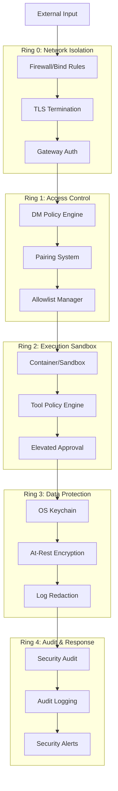
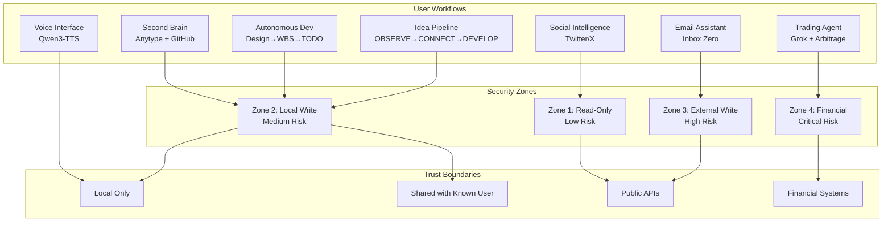
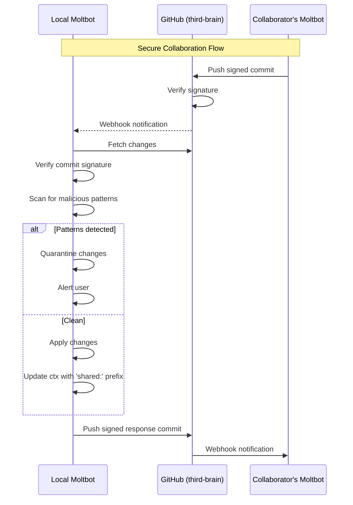
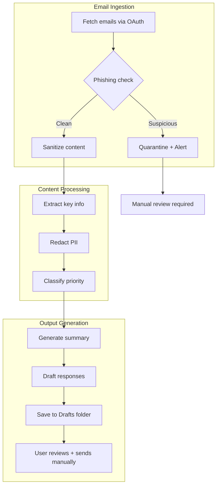
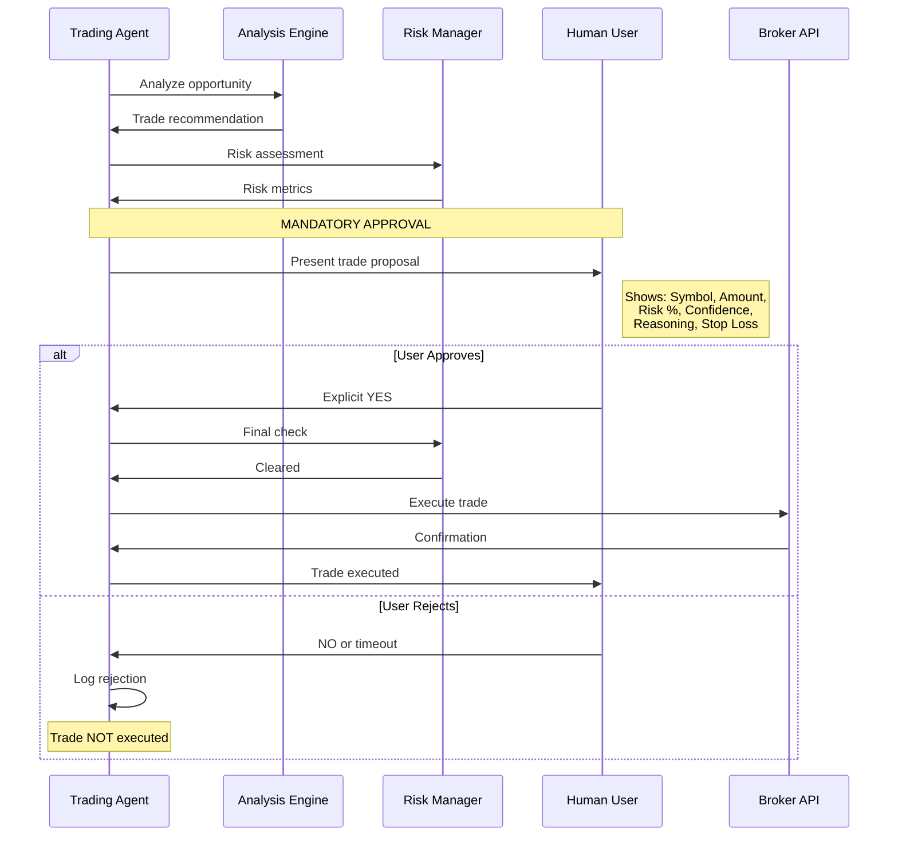

# Security Hardening by Default Design Document

| Field | Value |
|-------|-------|
| **Author(s)** | Moltbot Team |
| **Status** | Implementation In Progress |
| **Created** | 2026-01-29 |
| **Last Updated** | 2026-02-02 |
| **Reviewers** | TBD |
| **Approvers** | TBD |
| **Related Docs** | [Current Working Design](1-moltbot-current-working-design.md), [Security Audit Docs](https://docs.molt.bot/cli/security), [Anytype Security Analysis](anytype://Moltbot-Security-Analysis), [Second Mind Design](/Users/dmarpro/Documents/Projects/second-mind/design-docs/1-second-mind-current-working-design.md) |

---

## TL;DR

This document proposes changes to make Moltbot secure by default across all platforms (macOS, iOS, Android, CLI, Docker). The goal is to shift from "security requires configuration" to "secure out of the box" while maintaining usability. Key changes include: mandatory gateway authentication, sandboxed tool execution by default, stricter DM policies, encrypted credential storage, and platform-specific hardening for native apps.

**Part 2** extends this with **workflow-specific security profiles** for advanced use cases:
- **Second Brain** (Anytype MCP + shared GitHub third-brain repo with collaborator)
- **Twitter Intelligence** (AI news from timelines and Lists with content quarantine)
- **Email Assistant** (inbox zero summaries and draft responses, never auto-send)
- **Autonomous Dev** (design doc → WBS → TODO.md with HEARTBEAT and gap analysis)
- **Voice TTS** (local Qwen3-TTS for privacy-preserving voice output)
- **Trading Agent** (Grok for stocks, arbitrage on prediction markets - paper trading by default, ALL trades require human approval)
- **Idea Pipeline** (OBSERVE → CONNECT → DEVELOP loop for emergent ideas)

Each workflow has a dedicated security zone, trust boundary, and approval requirements designed to enable powerful automation while maintaining defense in depth.

---

## Implementation Status (2026-02-02)

| Component | Status | Notes |
|-----------|--------|-------|
| **Phase 1: Credential Storage** | 75% ✅ | macOS Keychain + encrypted file fallback complete; mobile backends pending |
| **Phase 2: Gateway Security** | 85% ✅ | Auto-token, loopback auth, token validation complete; native app integration pending |
| **Phase 3: Sandboxed Execution** | 30% | Default mode changed; network policy, dangerous tools approval flow pending |
| **Phase 4: Skill Vetting** | 0% | Not started |
| **Phase 5: Workflows** | 0% | Not started |
| **Phase 6: Multi-Model Routing** | 0% | Not started |
| **Phase 7: Collaboration Security** | 0% | Not started |
| **Phase 8: CLI & Documentation** | 50% ✅ | Security CLI commands complete; documentation updates in progress |

**Implemented Files:**
- `src/credentials/` - SecureCredentialStore with keychain and encrypted file backends
- `src/config/security-presets.ts` - Security level presets (standard/hardened/paranoid)
- `src/config/types.security.ts` - SecurityConfig type definitions
- `src/gateway/token.ts` - Secure token generation and validation
- `src/security/audit.ts` - Security audit checks (sandbox, credentials, dangerous tools)
- `src/security/audit-credentials.ts` - Credential storage audit and migration
- `src/cli/security-cli.ts` - Security commands (status, audit, configure, report, test)

**See TODO.md** for detailed implementation checklist and gap analysis.

---

## Context and Background

### Problem Statement

Recent security research (Cisco, Bitdefender, Noma Security, Snyk) has identified significant vulnerabilities in default Moltbot configurations:

1. **900+ exposed gateways** discovered on the internet with weak or no authentication
2. **Plaintext credential storage** vulnerable to memory poisoning and exfiltration
3. **Prompt injection attacks** can lead to arbitrary code execution on host systems
4. **Supply chain risks** from unvetted skills in ClawdHub/Molthub
5. **Open DM policies** allowing strangers to interact with bots

The current security model requires users to manually configure hardening options. Most users run with insecure defaults, creating a large attack surface.

### Current State

| Area | Current Default | Security Risk |
|------|-----------------|---------------|
| Gateway bind | `loopback` | Low (good default) |
| Gateway auth | Optional (no token required locally) | Medium - localhost bypass possible |
| DM policy | `pairing` | Medium - still allows strangers to request access |
| Tool execution | `sandbox.mode: "non-main"` | Medium - main session runs on host |
| Credential storage | Plaintext JSON files | High - trivially exfiltrated |
| Skill installation | No vetting | High - malicious code execution |
| Log redaction | `tools` (enabled) | Low (good default) |
| File permissions | User must run `--fix` | Medium - world-readable possible |

---

## Goals

| ID | Goal | Success Metric |
|----|------|----------------|
| G1 | Zero-config secure defaults | Fresh install passes `moltbot security audit --deep` with no critical findings |
| G2 | Defense in depth | At least 3 security layers between untrusted input and host system |
| G3 | Platform-appropriate hardening | Native apps use platform security features (Keychain, Secure Enclave, App Sandbox) |
| G4 | Credential protection | No plaintext secrets on disk; encrypted at rest with user-controlled keys |
| G5 | Minimal attack surface | Default tool profile is `minimal`; dangerous tools require explicit opt-in |
| G6 | Transparent security posture | Users can easily audit their security configuration |

## Non-Goals

- NG1: Achieving perfect security against all threat models (impossible)
- NG2: Supporting insecure legacy configurations without warnings
- NG3: Enterprise SSO/SAML integration (separate feature)
- NG4: Protecting against compromised host OS (out of scope)
- NG5: Preventing all prompt injection (fundamentally unsolvable with current LLMs)

---

## Proposed Design

### Architecture Overview



### Core Components

#### Component 1: Secure Gateway Defaults

**Responsibility:** Ensure gateway is never accidentally exposed to untrusted networks.

**Changes:**

```typescript
// NEW: src/config/defaults.security.ts
export const SECURE_GATEWAY_DEFAULTS = {
  gateway: {
    bind: 'loopback',  // unchanged
    auth: {
      mode: 'token',
      // NEW: Auto-generate token on first run if not set
      autoGenerateToken: true,
      // NEW: Require auth even for loopback connections
      requireAuthForLoopback: true,
      // NEW: Minimum token entropy
      minTokenLength: 32,
    },
    controlUi: {
      enabled: true,
      // CHANGED: Default to false (was implicitly true)
      allowInsecureAuth: false,
      // CHANGED: Default to false
      dangerouslyDisableDeviceAuth: false,
    },
    // NEW: Auto-detect reverse proxy and warn
    warnOnProxyWithoutTrust: true,
  },
}
```

**Key Behaviors:**
- Auto-generate cryptographically secure 32-byte token on first `moltbot onboard`
- Store token in OS keychain (macOS/iOS) or Android Keystore
- Require token auth even for localhost connections (defense against localhost proxy bypass)
- Block startup if gateway would bind to non-loopback without explicit `--i-know-what-im-doing` flag

#### Component 2: Strict DM Policy Engine

**Responsibility:** Prevent unauthorized access via messaging channels.

**Changes:**

```typescript
// NEW: Default DM policy for all channels
export const SECURE_DM_DEFAULTS = {
  channels: {
    _default: {
      // CHANGED: From 'pairing' to 'allowlist' for new installs
      dmPolicy: 'allowlist',
      // NEW: Auto-add current user on onboarding
      autoAllowOnboardingUser: true,
      // NEW: Require mention in all groups by default
      groups: {
        _default: {
          requireMention: true,
          // NEW: Default group policy is disabled until explicitly enabled
          policy: 'disabled',
        },
      },
    },
  },
  session: {
    // CHANGED: Isolate sessions by default
    dmScope: 'per-channel-peer',
  },
}
```

**Migration Path:**
1. Existing users keep current `dmPolicy` settings
2. New installs get `allowlist` default
3. `moltbot security audit` warns on `pairing` or `open` policies
4. Onboarding flow prompts user to approve their own identifier

#### Component 3: Sandboxed Execution by Default

**Responsibility:** Contain tool execution to prevent host compromise.

**Changes:**

```typescript
// NEW: Sandbox defaults
export const SECURE_SANDBOX_DEFAULTS = {
  sandbox: {
    // CHANGED: From 'non-main' to 'all'
    mode: 'all',
    // CHANGED: From 'session' to 'agent' (more isolation)
    scope: 'agent',
    // NEW: Resource limits
    limits: {
      memory: '2g',
      cpus: 1,
      timeout: 300_000, // 5 minutes
    },
    // NEW: Network policy
    network: {
      // Only allow connections to known AI provider domains
      allowlist: [
        'api.anthropic.com',
        'api.openai.com',
        '*.bedrock.*.amazonaws.com',
      ],
      // Block all other outbound by default
      defaultPolicy: 'deny',
    },
  },
  tools: {
    // CHANGED: From 'coding' to 'minimal'
    profile: 'minimal',
    // NEW: Dangerous tools require explicit opt-in
    dangerousTools: {
      browser: { enabled: false, requireApproval: true },
      canvas: { enabled: false, requireApproval: true },
      cron: { enabled: false, requireApproval: true },
      exec: { enabled: false, requireApproval: true },
    },
    // NEW: Elevated execution disabled by default
    elevated: {
      enabled: false,
      // When enabled, require per-invocation approval
      requireApproval: true,
    },
  },
}
```

**Platform-Specific Sandboxing:**

| Platform | Sandbox Implementation |
|----------|------------------------|
| macOS CLI | Docker container with `--cap-drop=ALL` |
| macOS App | App Sandbox entitlements + XPC service |
| iOS | App Sandbox (enforced by OS) |
| Android | Isolated process with restricted permissions |
| Linux CLI | Docker or Bubblewrap (bwrap) |
| Windows CLI | Windows Sandbox or Docker |

#### Component 4: Encrypted Credential Storage

**Responsibility:** Protect secrets at rest using platform security features.

**Changes:**

```typescript
// NEW: src/credentials/secure-store.ts
export interface SecureCredentialStore {
  // Platform-specific implementations
  get(key: string): Promise<string | null>
  set(key: string, value: string): Promise<void>
  delete(key: string): Promise<void>
  list(): Promise<string[]>
}

// Implementations:
// - macOS: Keychain Services (Security.framework)
// - iOS: Keychain with kSecAttrAccessibleWhenUnlockedThisDeviceOnly
// - Android: EncryptedSharedPreferences + Android Keystore
// - Linux: libsecret (GNOME Keyring / KWallet)
// - Windows: Windows Credential Manager
// - Fallback: Age-encrypted file with passphrase
```

**Migration Path:**
1. On upgrade, detect plaintext credentials in `~/.clawdbot/credentials/`
2. Prompt user to migrate to secure storage
3. `moltbot security audit --fix` performs migration automatically
4. After migration, securely delete plaintext files (overwrite + unlink)

**Credential Categories:**

| Category | Storage | Access |
|----------|---------|--------|
| API Keys (Anthropic, OpenAI) | Keychain | Agent process only |
| Channel Tokens (Discord, Telegram) | Keychain | Gateway process only |
| Gateway Auth Token | Keychain | CLI + native apps |
| OAuth Refresh Tokens | Keychain | Per-channel adapter |
| Session Encryption Keys | Secure Enclave (where available) | Derived per-session |

#### Component 5: Skill Vetting & Allowlist

**Responsibility:** Prevent malicious skill installation.

**Changes:**

```typescript
// NEW: src/skills/vetting.ts
export interface SkillVettingResult {
  safe: boolean
  risks: SkillRisk[]
  requiredPermissions: Permission[]
  networkAccess: string[]
  fileAccess: string[]
}

export async function vetSkill(skillPath: string): Promise<SkillVettingResult> {
  // Static analysis checks:
  // 1. Shell command patterns (curl, wget, nc, bash -c, etc.)
  // 2. File system access outside workspace
  // 3. Network connections to non-allowlisted domains
  // 4. Obfuscated code patterns
  // 5. Known malicious signatures (from Cisco Skill Scanner database)
  // 6. Excessive permission requests
}
```

**Changes to Skill Installation:**

```typescript
// NEW: Skill installation defaults
export const SECURE_SKILL_DEFAULTS = {
  skills: {
    // NEW: Require explicit allowlist
    requireAllowlist: true,
    // NEW: Show detailed permission prompt before install
    showPermissionPrompt: true,
    // NEW: Quarantine new skills for 24h before activation
    quarantinePeriod: 86400_000,
    // NEW: Auto-scan with vetting engine
    autoVet: true,
    // NEW: Block skills with critical risks
    blockCriticalRisks: true,
    // NEW: Signature verification for official skills
    requireSignature: 'official', // 'official' | 'any' | 'none'
  },
}
```

#### Component 6: Security Audit Enhancements

**Responsibility:** Make security posture visible and actionable.

**New Audit Checks:**

| Check ID | Severity | Description |
|----------|----------|-------------|
| `gateway.auth.missing_loopback` | Critical | No auth even for localhost |
| `gateway.auth.weak_token` | Critical | Token < 32 chars or low entropy |
| `credentials.plaintext` | Critical | Plaintext secrets on disk |
| `credentials.keychain_unavailable` | Warn | Falling back to encrypted file |
| `sandbox.mode.off` | Critical | No sandboxing enabled |
| `sandbox.network.unrestricted` | Warn | Sandbox allows all outbound |
| `tools.dangerous.enabled` | Warn | Dangerous tools enabled without approval |
| `skills.unvetted` | Warn | Installed skills not vetted |
| `skills.quarantined` | Info | Skills in quarantine period |
| `platform.sandbox.disabled` | Critical | App Sandbox not enforced (macOS) |
| `platform.hardened_runtime` | Warn | Hardened Runtime not enabled |

**New CLI Commands:**

```bash
# Show security posture summary
moltbot security status

# Interactive security configuration wizard
moltbot security configure

# Export security report (for compliance)
moltbot security report --format json|html|pdf

# Simulate attack scenarios
moltbot security test --scenario prompt-injection
moltbot security test --scenario credential-exfil
moltbot security test --scenario skill-malware
```

---

## Part 2: Workflow-Specific Security Profiles

This section defines secure configurations for specific high-value workflows that require elevated permissions while maintaining defense in depth.

### Workflow Architecture Overview



### Workflow 1: Second Brain Integration (Anytype + GitHub)

**Use Case:** Local second-brain project synced with Anytype MCP, with a shared "third-brain" GitHub repo collaborated on by another user's Moltbot.

**Trust Model:**
- **Local Anytype:** Fully trusted (runs on localhost:31009)
- **Local second-brain folder:** Fully trusted
- **third-brain GitHub repo:** Partially trusted (shared with known collaborator)
- **Collaborator's Moltbot:** Untrusted (treat as external input)

**Security Configuration:**

```typescript
// Workflow profile: second-brain
export const SECOND_BRAIN_PROFILE = {
  id: 'second-brain',

  // Scoped to specific directories
  filesystem: {
    allowedPaths: [
      '~/Documents/Projects/second-mind',
      '~/Documents/Projects/third-brain',
    ],
    // Deny access to other sensitive dirs
    deniedPaths: [
      '~/.ssh',
      '~/.gnupg',
      '~/.aws',
      '~/.*credentials*',
    ],
    // Allow write only to scoped paths
    writePolicy: 'scoped',
  },

  // Anytype MCP configuration
  mcp: {
    anytype: {
      enabled: true,
      // Anytype API on localhost only
      endpoint: 'http://127.0.0.1:31009',
      // Store API key in keychain, not config
      apiKeySource: 'keychain:anytype-api-key',
      // Allowed operations
      permissions: {
        read: true,
        write: true,
        delete: false,  // Require manual approval for deletes
      },
      // Rate limiting to prevent runaway
      rateLimit: {
        requestsPerMinute: 60,
        maxConcurrent: 5,
      },
    },
  },

  // GitHub integration for third-brain
  github: {
    repos: {
      'third-brain': {
        // Only this repo is accessible
        url: 'github.com/username/third-brain',
        // Permissions
        permissions: {
          read: true,
          write: true,
          // Require signed commits
          requireSignedCommits: true,
          // Branch protection
          protectedBranches: ['main'],
          // PR required for protected branches
          requirePRForProtected: true,
        },
        // Collaboration security
        collaboration: {
          // Known collaborator's Moltbot identity
          trustedCollaborators: ['collaborator-moltbot-id'],
          // Verify commit signatures from collaborators
          verifyCollaboratorSignatures: true,
          // Auto-reject commits with suspicious patterns
          rejectPatterns: [
            /rm\s+-rf/,
            /curl.*\|.*sh/,
            /eval\s*\(/,
          ],
        },
      },
    },
  },

  // ctx integration for knowledge flow
  ctx: {
    enabled: true,
    storePath: '~/.ctx-store',
    // Cross-repo knowledge sharing
    allowedRepos: [
      'second-mind',
      'third-brain',
      'moltbot-max',
    ],
    // Keyword namespacing to prevent conflicts
    namespacing: {
      enabled: true,
      prefix: 'local:', // vs 'shared:' for third-brain
    },
  },
}
```

**Collaboration Security Protocol:**



### Workflow 2: Twitter/X Social Intelligence

**Use Case:** Aggregate AI news from For You timeline, Following timeline, and pinned Lists using Twitter/X algorithms.

**Trust Model:**
- **Twitter API:** Semi-trusted (rate-limited, read-only)
- **Timeline content:** Untrusted (potential prompt injection vectors)
- **AI news extraction:** Output only, never execute

**Security Configuration:**

```typescript
export const TWITTER_INTELLIGENCE_PROFILE = {
  id: 'twitter-intelligence',

  // OAuth configuration
  oauth: {
    provider: 'twitter',
    // Store tokens in keychain
    tokenStorage: 'keychain:twitter-oauth',
    // Minimal scopes required
    scopes: [
      'tweet.read',
      'users.read',
      'list.read',
      // NO write scopes - read only
    ],
    // Token rotation
    refreshInterval: 86400_000, // 24 hours
  },

  // API access restrictions
  api: {
    // Allowed endpoints (allowlist)
    allowedEndpoints: [
      'GET /2/users/:id/timelines/reverse_chronological',
      'GET /2/users/:id/following',
      'GET /2/lists/:id/tweets',
      'GET /2/users/:id/owned_lists',
      'GET /2/users/:id/pinned_lists',
    ],
    // Explicitly deny write endpoints
    deniedEndpoints: [
      'POST *',
      'PUT *',
      'DELETE *',
    ],
    // Rate limiting (stricter than Twitter's)
    rateLimit: {
      requestsPerMinute: 30,
      requestsPerDay: 1000,
    },
  },

  // Content processing security
  contentSecurity: {
    // Treat all timeline content as untrusted
    trustLevel: 'untrusted',
    // Sanitization before processing
    sanitization: {
      // Strip potential injection patterns
      stripPatterns: [
        /ignore previous instructions/i,
        /system prompt/i,
        /```.*execute/i,
      ],
      // Escape special characters
      escapeMarkdown: true,
      // Max content length per tweet
      maxContentLength: 1000,
    },
    // Content quarantine for suspicious posts
    quarantine: {
      enabled: true,
      triggerPatterns: [
        /urgent.*action.*required/i,
        /click.*link.*immediately/i,
      ],
    },
  },

  // Output configuration
  output: {
    // Where to store aggregated intelligence
    destination: '~/Documents/Projects/second-mind/feeds/twitter-ai-news.md',
    // Format
    format: 'markdown',
    // Never execute any extracted content
    executeExtractedContent: false,
    // Summary only, not raw tweets
    summaryMode: true,
  },

  // Schedule
  schedule: {
    // How often to fetch
    interval: 3600_000, // 1 hour
    // Quiet hours (no fetching)
    quietHours: { start: 23, end: 7 },
  },
}
```

**Content Quarantine Flow:**

```typescript
// NEW: src/workflows/twitter/content-filter.ts
export async function filterTwitterContent(
  tweets: Tweet[]
): Promise<FilteredContent> {
  const results: FilteredContent = {
    safe: [],
    quarantined: [],
    rejected: [],
  }

  for (const tweet of tweets) {
    // Step 1: Check for injection patterns
    if (containsInjectionPatterns(tweet.text)) {
      results.quarantined.push({
        tweet,
        reason: 'potential_injection',
        // Store for manual review
        reviewPath: `~/quarantine/twitter/${tweet.id}.json`,
      })
      continue
    }

    // Step 2: Sanitize content
    const sanitized = sanitizeTweetContent(tweet.text)

    // Step 3: Extract AI news relevance
    const relevance = await classifyAINewsRelevance(sanitized)

    if (relevance.score > 0.7) {
      results.safe.push({
        ...tweet,
        text: sanitized,
        relevance,
      })
    }
  }

  return results
}
```

### Workflow 3: Email Assistant (Inbox Zero)

**Use Case:** Read emails, summarize daily inbox, suggest inbox zero actions, and draft responses for emails requiring reply.

**Trust Model:**
- **Email API (Gmail/etc):** Trusted for read, cautious for write
- **Email content:** Untrusted (phishing, injection vectors)
- **Draft creation:** Allowed, but never auto-send
- **PII in emails:** Handle with care, redact in logs

**Security Configuration:**

```typescript
export const EMAIL_ASSISTANT_PROFILE = {
  id: 'email-assistant',

  // OAuth configuration
  oauth: {
    provider: 'google', // or 'microsoft', 'imap'
    tokenStorage: 'keychain:email-oauth',
    scopes: [
      'https://www.googleapis.com/auth/gmail.readonly',
      'https://www.googleapis.com/auth/gmail.compose', // drafts only
      // NO gmail.send scope - drafts only, never auto-send
    ],
  },

  // Email access restrictions
  access: {
    // Read permissions
    read: {
      enabled: true,
      // Time window for reading (last 24 hours)
      timeWindow: 86400_000,
      // Max emails to process per run
      maxEmails: 100,
      // Labels to include
      includeLabels: ['INBOX', 'IMPORTANT'],
      // Labels to exclude
      excludeLabels: ['SPAM', 'TRASH'],
    },
    // Write permissions
    write: {
      // Can create drafts
      createDrafts: true,
      // NEVER auto-send
      autoSend: false,
      // Can apply labels
      applyLabels: true,
      // Can archive (move to archive, not delete)
      archive: true,
      // NEVER delete
      delete: false,
    },
  },

  // PII handling
  pii: {
    // Redact PII in logs
    redactInLogs: true,
    // PII patterns to detect and redact
    patterns: [
      { type: 'ssn', regex: /\b\d{3}-\d{2}-\d{4}\b/ },
      { type: 'credit_card', regex: /\b\d{4}[\s-]?\d{4}[\s-]?\d{4}[\s-]?\d{4}\b/ },
      { type: 'phone', regex: /\b\d{3}[-.]?\d{3}[-.]?\d{4}\b/ },
    ],
    // Never include PII in summaries
    excludeFromSummaries: true,
  },

  // Content security
  contentSecurity: {
    trustLevel: 'untrusted',
    // Phishing detection
    phishingDetection: {
      enabled: true,
      // Flag suspicious senders
      flagSuspiciousSenders: true,
      // Patterns that trigger review
      suspiciousPatterns: [
        /urgent.*verify.*account/i,
        /click.*here.*confirm/i,
        /password.*expire/i,
      ],
    },
    // Link handling
    links: {
      // Never auto-click links
      autoClick: false,
      // Extract and display, but warn
      extractForReview: true,
    },
  },

  // Draft generation
  drafts: {
    // Template for responses
    requireApprovalBefore: 'send', // user must manually send
    // Include disclaimer
    disclaimer: '--- Draft generated by Moltbot. Please review before sending. ---',
    // Tone guidelines
    toneGuidelines: 'professional, concise, helpful',
  },

  // Summary output
  summary: {
    destination: '~/Documents/Projects/second-mind/feeds/email-daily-summary.md',
    format: 'markdown',
    sections: [
      'urgent_requiring_response',
      'fyi_informational',
      'promotional_bulk',
      'suggested_actions',
    ],
  },

  // Schedule
  schedule: {
    // Daily summary at 8am
    dailySummary: { cron: '0 8 * * *' },
    // Inbox zero review at 6pm
    inboxZeroReview: { cron: '0 18 * * *' },
  },
}
```

**Email Processing Security:**



### Workflow 4: Autonomous Development (Design Doc → WBS → TODO)

**Use Case:** Scope to one or multiple projects, find unimplemented design docs, use `/wbs-generator` to create TODO.md, then iterate autonomously with HEARTBEAT until complete, running gap analysis at each phase.

**Trust Model:**
- **Local project files:** Trusted
- **Design docs:** Trusted (human-authored)
- **Generated code:** Semi-trusted (requires validation)
- **HEARTBEAT autonomous actions:** Bounded by permission model

**Security Configuration:**

```typescript
export const AUTONOMOUS_DEV_PROFILE = {
  id: 'autonomous-dev',

  // Project scoping
  projects: {
    // List of allowed project paths
    allowed: [
      '~/Documents/Projects/moltbot-max',
      '~/Documents/Projects/second-mind',
      '~/Documents/Projects/third-brain',
    ],
    // Auto-discover design docs
    designDocPatterns: [
      '**/design-docs/*.md',
      '**/docs/design/*.md',
      '**/RFC-*.md',
    ],
    // Exclude patterns
    excludePatterns: [
      '**/node_modules/**',
      '**/.git/**',
      '**/dist/**',
    ],
  },

  // HEARTBEAT configuration
  heartbeat: {
    enabled: true,
    // Interval (hourly like second-mind)
    interval: 3600_000,
    // Permission model
    permissions: {
      // Autonomous (no approval needed)
      autonomous: [
        'create_todo',
        'update_todo',
        'create_seed',
        'expand_idea',
        'run_tests',
        'read_files',
        'search_code',
        'gap_analysis',
      ],
      // Requires approval
      requiresApproval: [
        'delete_files',
        'modify_core_code',
        'git_commit',
        'git_push',
        'external_api_calls',
      ],
    },
    // Resource limits per cycle
    limits: {
      maxDuration: 900_000, // 15 minutes max per cycle
      maxFileChanges: 20,
      maxNewFiles: 5,
    },
  },

  // WBS workflow
  wbs: {
    // Skill to use
    skill: 'wbs-generator',
    // Output location
    outputPath: 'TODO.md',
    // Validation
    validation: {
      // Require design doc alignment check
      requireAlignmentCheck: true,
      // Gap analysis at each phase
      gapAnalysisFrequency: 'per-phase',
      // Deficiency detection
      deficiencyDetection: true,
      // Error analysis
      errorAnalysis: true,
      // Improvement suggestions
      improvementSuggestions: true,
    },
  },

  // Development loop
  devLoop: {
    // Pattern chain from second-mind
    phases: ['OBSERVE', 'CONNECT', 'DEVELOP', 'VALIDATE'],
    // Validation phase additions
    validate: {
      // Compare against design doc
      designDocAlignment: true,
      // Run linter
      runLinter: true,
      // Run tests
      runTests: true,
      // Check for regressions
      regressionCheck: true,
    },
    // Exit conditions
    exitConditions: {
      // TODO.md fully complete
      todoComplete: true,
      // Or max iterations reached
      maxIterations: 50,
      // Or critical error
      onCriticalError: 'pause_and_alert',
    },
  },

  // Sandbox for code execution
  sandbox: {
    mode: 'all',
    // Allow test execution
    allowTestExecution: true,
    // Allow linter execution
    allowLinterExecution: true,
    // Network for dependency installation
    network: {
      allowlist: [
        'registry.npmjs.org',
        'api.anthropic.com',
      ],
    },
  },
}
```

**Autonomous Development Loop:**

```mermaid
flowchart TD
    subgraph "Phase 1: Discovery"
        A[Scan project for design docs] --> B{Unimplemented?}
        B -->|Yes| C[Select design doc]
        B -->|No| Z[Sleep until next HEARTBEAT]
    end

    subgraph "Phase 2: Planning"
        C --> D[/wbs-generator skill]
        D --> E[Create TODO.md]
    end

    subgraph "Phase 3: Development Loop"
        E --> F[OBSERVE: Read current state]
        F --> G[CONNECT: Identify next task]
        G --> H[DEVELOP: Implement task]
        H --> I[VALIDATE: Gap analysis]
    end

    subgraph "Phase 4: Validation"
        I --> J{Aligned with design?}
        J -->|Yes| K{TODO complete?}
        J -->|No| L[Log deficiency]
        L --> M[Adjust approach]
        M --> F
        K -->|No| F
        K -->|Yes| N[Mark complete]
    end

    subgraph "Gap Analysis"
        I --> O[Check design alignment]
        I --> P[Detect deficiencies]
        I --> Q[Find errors]
        I --> R[Suggest improvements]
    end
```

### Workflow 5: Voice Interface (Qwen3-TTS)

**Use Case:** Responses delivered via Qwen3-TTS (1.7B parameter local model) for voice output.

**Trust Model:**
- **Local TTS model:** Fully trusted (runs locally)
- **Audio output:** Low risk (no sensitive data in audio)
- **No network required:** Privacy-preserving

**Security Configuration:**

```typescript
export const VOICE_TTS_PROFILE = {
  id: 'voice-tts',

  // Model configuration
  model: {
    name: 'Qwen3-TTS',
    parameters: '1.7B',
    // Local execution only
    execution: 'local',
    // Model path
    modelPath: '~/.moltbot/models/qwen3-tts-1.7b',
    // No network access needed
    networkAccess: false,
  },

  // Voice output settings
  voice: {
    // Default voice profile
    defaultVoice: 'neutral',
    // Speed
    speed: 1.0,
    // Output format
    format: 'wav',
    // Temporary file location
    tempDir: '/tmp/moltbot-tts',
    // Auto-cleanup
    cleanupAfter: 300_000, // 5 minutes
  },

  // Content filtering before TTS
  contentFilter: {
    // Redact sensitive info before speaking
    redactBeforeSpeaking: [
      'api_keys',
      'passwords',
      'credit_cards',
      'ssn',
    ],
    // Replace with placeholder
    redactionPhrase: 'sensitive information redacted',
    // Max length to speak
    maxLength: 5000,
  },

  // Privacy settings
  privacy: {
    // Never send audio to cloud
    cloudUpload: false,
    // Don't log spoken content
    logSpokenContent: false,
    // Don't save audio files permanently
    persistAudio: false,
  },

  // Integration with other workflows
  integration: {
    // Workflows that can use TTS output
    enabledFor: [
      'email-assistant',  // Speak email summaries
      'twitter-intelligence',  // Speak AI news
      'autonomous-dev',  // Speak status updates
    ],
    // Trigger conditions
    triggers: {
      // On explicit request
      onRequest: true,
      // On important notifications
      onImportantNotification: true,
      // Never for sensitive workflows
      neverFor: ['trading-agent'],
    },
  },
}
```

### Workflow 6: Trading Agent (Grok + Arbitrage)

**Use Case:** Grok model for stock market investing and portfolio management, plus real-time arbitrage trading on crypto prediction markets and sports predictions.

**Trust Model:**
- **Trading APIs:** Critical trust (real money)
- **Market data:** Semi-trusted (can be manipulated)
- **Prediction sources:** Untrusted (verify independently)
- **Financial decisions:** ALWAYS require human approval

**CRITICAL SECURITY WARNING:** This workflow involves real financial risk. All trades MUST require human approval. Never enable autonomous trading without explicit user consent and understanding of risks.

**Security Configuration:**

```typescript
export const TRADING_AGENT_PROFILE = {
  id: 'trading-agent',

  // CRITICAL: Security level
  securityLevel: 'paranoid',

  // Model routing
  models: {
    // Grok for market analysis
    marketAnalysis: {
      provider: 'xai',
      model: 'grok-2',
      apiKeySource: 'keychain:xai-api-key',
      // Dedicated to trading only
      isolatedContext: true,
    },
    // Quantitative analysis model
    quantitative: {
      provider: 'anthropic',
      model: 'claude-opus-4-5-20251101',
      apiKeySource: 'keychain:anthropic-api-key',
      // For complex calculations
      useFor: ['arbitrage_calc', 'risk_analysis', 'backtesting'],
    },
  },

  // Trading platforms
  platforms: {
    // Stock trading
    stocks: {
      broker: 'alpaca', // or 'ibkr', 'schwab'
      apiKeySource: 'keychain:alpaca-api-key',
      // Paper trading first
      paperTradingMode: true, // SET TO TRUE BY DEFAULT
      // Position limits
      limits: {
        maxPositionSize: 1000, // USD
        maxDailyTrades: 10,
        maxPortfolioRisk: 0.02, // 2% max risk
      },
    },
    // Crypto prediction markets
    crypto: {
      platforms: ['polymarket', 'kalshi'],
      apiKeySource: 'keychain:crypto-trading-keys',
      // Limits
      limits: {
        maxBetSize: 100, // USD
        maxDailyBets: 5,
        maxExposure: 500, // USD
      },
    },
  },

  // CRITICAL: Approval requirements
  approvals: {
    // ALL trades require human approval
    requireApprovalFor: {
      allTrades: true,
      portfolioChanges: true,
      newPositions: true,
      positionIncrease: true,
      // Even analysis that costs money
      paidDataSources: true,
    },
    // Approval flow
    approvalFlow: {
      // Show full trade details
      showTradeDetails: true,
      // Show risk analysis
      showRiskAnalysis: true,
      // Show confidence level
      showConfidence: true,
      // Require explicit confirmation
      confirmationMethod: 'explicit_yes',
      // Timeout (no auto-approve)
      timeout: null, // Never auto-approve
    },
  },

  // Risk management
  riskManagement: {
    // Stop loss on all positions
    stopLoss: {
      enabled: true,
      defaultPercent: 5,
    },
    // Daily loss limit
    dailyLossLimit: {
      enabled: true,
      maxLoss: 200, // USD
      action: 'halt_trading',
    },
    // Drawdown protection
    drawdownProtection: {
      enabled: true,
      maxDrawdown: 0.1, // 10%
      action: 'alert_and_halt',
    },
  },

  // Data sources
  dataSources: {
    // Market data
    marketData: {
      providers: ['yahoo_finance', 'alpha_vantage'],
      // Cache to reduce API calls
      cacheTime: 60_000, // 1 minute
    },
    // News and sentiment
    news: {
      providers: ['newsapi', 'twitter_intelligence_workflow'],
      // Verify from multiple sources
      requireMultipleSourcesFor: ['trade_decisions'],
    },
    // Weather (for predictions)
    weather: {
      providers: ['openweathermap', 'noaa'],
    },
  },

  // Arbitrage configuration
  arbitrage: {
    // Enable only after explicit user consent
    enabled: false, // USER MUST ENABLE
    // Types allowed
    allowedTypes: [
      'cross_exchange_crypto',
      'prediction_market_arbitrage',
    ],
    // Execution
    execution: {
      // Never auto-execute
      autoExecute: false,
      // Show opportunity, user decides
      showOpportunity: true,
      // Time limit to act
      opportunityTTL: 60_000, // 1 minute
    },
  },

  // Audit trail
  audit: {
    // Log all trading activity
    logAllActivity: true,
    // Store in secure location
    logPath: '~/.moltbot/trading-audit.jsonl',
    // Include
    logFields: [
      'timestamp',
      'action',
      'symbol',
      'amount',
      'price',
      'reasoning',
      'approval_status',
      'execution_result',
    ],
    // Retain for
    retentionDays: 365,
  },

  // Isolation
  isolation: {
    // Separate sandbox
    sandbox: {
      mode: 'all',
      scope: 'dedicated', // Own sandbox instance
      // No access to other workflows' data
      crossWorkflowAccess: false,
    },
    // Separate credentials namespace
    credentialNamespace: 'trading',
  },
}
```

**Trading Approval Flow:**



### Workflow 7: Emergent Ideas Pipeline (OBSERVE → CONNECT → DEVELOP)

**Use Case:** Continuously identify emergent ideas from all workflows, then autonomously develop them through the idea-to-development loop as defined in second-mind.

**Trust Model:**
- **Observation data:** Aggregated from trusted workflows
- **Pattern detection:** AI-assisted, human-validated
- **Idea development:** Autonomous but bounded
- **Code generation:** Sandboxed, requires review for production

**Security Configuration:**

```typescript
export const IDEA_PIPELINE_PROFILE = {
  id: 'idea-pipeline',

  // Pattern chain (from second-mind)
  patternChain: {
    // OBSERVE phase
    observe: {
      // Sources to observe
      sources: [
        { workflow: 'second-brain', weight: 1.0 },
        { workflow: 'twitter-intelligence', weight: 0.7 },
        { workflow: 'email-assistant', weight: 0.5 },
        { workflow: 'autonomous-dev', weight: 0.8 },
        { workflow: 'trading-agent', weight: 0.6, excludeFinancials: true },
      ],
      // Observation frequency
      frequency: 3600_000, // 1 hour (aligned with HEARTBEAT)
      // Output format
      output: 'json',
    },

    // CONNECT phase
    connect: {
      // Pattern detection
      patterns: {
        // Minimum connections to flag
        minConnections: 2,
        // Confidence threshold
        confidenceThreshold: 0.6,
        // Types of connections
        connectionTypes: [
          'thematic',      // Similar themes
          'temporal',      // Time-based patterns
          'causal',        // Cause-effect relationships
          'complementary', // Ideas that enhance each other
        ],
      },
      // Output
      output: 'json',
    },

    // DEVELOP phase
    develop: {
      // What DEVELOP can do autonomously
      autonomous: [
        'create_seed',
        'expand_seed',
        'create_connection_map',
        'draft_insight',
        'update_ctx',
      ],
      // What requires approval
      requiresApproval: [
        'promote_to_insight',
        'create_project',
        'external_action',
        'delete_content',
      ],
      // Output location
      outputPath: '~/Documents/Projects/second-mind',
    },
  },

  // Integration with ctx
  ctx: {
    // Auto-capture patterns
    autoCapture: {
      decisions: true,
      learnings: true,
      questions: true,
    },
    // Keyword generation
    autoKeywords: true,
    // Cross-repo linking
    crossRepoLinking: true,
  },

  // Seed management
  seeds: {
    // Where seeds are stored
    seedPath: '~/Documents/Projects/second-mind/seeds',
    // Maturity tracking
    maturityLevels: ['planted', 'sprouting', 'growing', 'mature'],
    // Promotion criteria
    promotionCriteria: {
      toSprouting: { connections: 1, expansions: 1 },
      toGrowing: { connections: 3, expansions: 3, validations: 1 },
      toMature: { connections: 5, expansions: 5, validations: 3, humanReview: true },
    },
  },

  // Insight distillation
  insights: {
    // When to distill seeds into insights
    distillationCriteria: {
      // Cluster size threshold
      clusterSize: 3,
      // Maturity requirement
      maturityLevel: 'mature',
      // Human validation required
      requireHumanValidation: true,
    },
    // Output path
    insightPath: '~/Documents/Projects/second-mind/insights',
  },

  // Development loop (idea → implementation)
  devLoop: {
    // When to trigger development
    triggers: {
      // Insight reaches "actionable" status
      onActionableInsight: true,
      // Explicit request
      onRequest: true,
      // Scheduled review
      scheduledReview: { cron: '0 9 * * 1' }, // Monday 9am
    },
    // Development phases
    phases: [
      'ideation',      // Expand the idea
      'specification', // Create spec/design doc
      'planning',      // /wbs-generator → TODO.md
      'implementation', // Autonomous dev loop
      'validation',    // Gap analysis
      'integration',   // Merge to main codebase
    ],
    // Gate requirements
    gates: {
      // Spec review before planning
      specReview: { requireHumanApproval: true },
      // Integration review
      integrationReview: { requireHumanApproval: true },
    },
  },

  // Safety boundaries
  safety: {
    // Max seeds in development
    maxConcurrentSeeds: 5,
    // Max development iterations
    maxDevIterations: 100,
    // Runaway detection
    runawayDetection: {
      enabled: true,
      // If no progress in X cycles, pause
      noProgressThreshold: 10,
      action: 'pause_and_alert',
    },
  },
}
```

**Idea Pipeline Flow:**

```mermaid
flowchart TD
    subgraph "Observation Layer"
        O1[Second Brain] --> OBS[OBSERVE]
        O2[Twitter Feed] --> OBS
        O3[Email Insights] --> OBS
        O4[Dev Activity] --> OBS
        O5[Trading Patterns] --> OBS
    end

    subgraph "Connection Layer"
        OBS --> CON[CONNECT]
        CON --> P1[Thematic Patterns]
        CON --> P2[Temporal Patterns]
        CON --> P3[Causal Links]
    end

    subgraph "Development Layer"
        P1 --> DEV[DEVELOP]
        P2 --> DEV
        P3 --> DEV
        DEV --> S[Create Seed]
        S --> E[Expand Seed]
        E --> C[Cluster Detection]
    end

    subgraph "Maturation"
        C --> M{Mature?}
        M -->|Yes| I[Distill to Insight]
        M -->|No| E
        I --> A{Actionable?}
        A -->|Yes| SPEC[Create Spec]
        A -->|No| PARK[Park for Later]
    end

    subgraph "Implementation"
        SPEC --> HR1{Human Review}
        HR1 -->|Approved| WBS[/wbs-generator]
        WBS --> TODO[TODO.md]
        TODO --> IMPL[Autonomous Dev Loop]
        IMPL --> GAP[Gap Analysis]
        GAP --> HR2{Human Review}
        HR2 -->|Approved| INT[Integrate]
    end
```

### Multi-Model Routing Configuration

**Use Case:** Different AI models optimized for different workflows.

```typescript
export const MODEL_ROUTING_CONFIG = {
  // Default model for general use
  default: {
    provider: 'anthropic',
    model: 'claude-opus-4-5-20251101',
  },

  // Workflow-specific routing
  routes: {
    // Second brain - needs reasoning
    'second-brain': {
      provider: 'anthropic',
      model: 'claude-opus-4-5-20251101',
    },

    // Twitter - fast summarization
    'twitter-intelligence': {
      provider: 'anthropic',
      model: 'claude-sonnet-4-20250514',
    },

    // Email - balanced
    'email-assistant': {
      provider: 'anthropic',
      model: 'claude-sonnet-4-20250514',
    },

    // Autonomous dev - needs coding capability
    'autonomous-dev': {
      provider: 'anthropic',
      model: 'claude-opus-4-5-20251101',
    },

    // Voice TTS - local model
    'voice-tts': {
      provider: 'local',
      model: 'qwen3-tts-1.7b',
    },

    // Trading - Grok for market analysis
    'trading-agent': {
      // Market analysis
      analysis: {
        provider: 'xai',
        model: 'grok-2',
      },
      // Quantitative calculations
      quantitative: {
        provider: 'anthropic',
        model: 'claude-opus-4-5-20251101',
      },
    },

    // Idea pipeline - reasoning heavy
    'idea-pipeline': {
      provider: 'anthropic',
      model: 'claude-opus-4-5-20251101',
    },
  },

  // Fallback chain
  fallback: [
    { provider: 'anthropic', model: 'claude-sonnet-4-20250514' },
    { provider: 'openai', model: 'gpt-4o' },
  ],

  // Cost management
  costs: {
    // Budget per workflow per day
    dailyBudgets: {
      'second-brain': 5.00,
      'twitter-intelligence': 1.00,
      'email-assistant': 2.00,
      'autonomous-dev': 10.00,
      'trading-agent': 5.00,
      'idea-pipeline': 3.00,
    },
    // Alert threshold
    alertThreshold: 0.8, // Alert at 80% of budget
    // Hard stop
    hardStop: true, // Stop workflow at 100%
  },
}
```

---

### Data Model

#### Secure Configuration Schema

```typescript
// NEW: src/config/types.security.ts
export interface SecurityConfig {
  // Master security level (applies sensible defaults)
  level: 'standard' | 'hardened' | 'paranoid'

  gateway: {
    auth: {
      mode: 'token' | 'password'
      autoGenerateToken: boolean
      requireAuthForLoopback: boolean
      minTokenLength: number
    }
  }

  sandbox: {
    mode: 'off' | 'non-main' | 'all'
    scope: 'session' | 'agent' | 'shared'
    limits: ResourceLimits
    network: NetworkPolicy
  }

  credentials: {
    store: 'keychain' | 'encrypted-file' | 'plaintext'
    // For encrypted-file fallback
    encryptionKey?: 'passphrase' | 'hardware' | 'env'
  }

  skills: {
    requireAllowlist: boolean
    autoVet: boolean
    blockCriticalRisks: boolean
    quarantinePeriod: number
    requireSignature: 'official' | 'any' | 'none'
  }

  audit: {
    // Run audit on gateway start
    runOnStart: boolean
    // Block start if critical findings
    blockOnCritical: boolean
    // Send alerts for security events
    alerting: {
      enabled: boolean
      webhook?: string
    }
  }
}
```

#### Security Level Presets

```typescript
export const SECURITY_PRESETS = {
  standard: {
    // Good defaults for most users
    'gateway.auth.requireAuthForLoopback': false,
    'sandbox.mode': 'non-main',
    'tools.profile': 'coding',
    'skills.quarantinePeriod': 0,
  },
  hardened: {
    // Recommended for production use
    'gateway.auth.requireAuthForLoopback': true,
    'sandbox.mode': 'all',
    'tools.profile': 'minimal',
    'skills.quarantinePeriod': 86400_000,
    'skills.requireSignature': 'official',
  },
  paranoid: {
    // Maximum security, reduced functionality
    'gateway.auth.requireAuthForLoopback': true,
    'sandbox.mode': 'all',
    'sandbox.network.defaultPolicy': 'deny',
    'tools.profile': 'minimal',
    'tools.elevated.enabled': false,
    'skills.requireAllowlist': true,
    'skills.blockCriticalRisks': true,
    'audit.blockOnCritical': true,
  },
}
```

### Platform-Specific Hardening

#### macOS App

```swift
// Entitlements (Moltbot.entitlements)
<?xml version="1.0" encoding="UTF-8"?>
<!DOCTYPE plist PUBLIC "-//Apple//DTD PLIST 1.0//EN" "...">
<plist version="1.0">
<dict>
    <!-- App Sandbox (REQUIRED) -->
    <key>com.apple.security.app-sandbox</key>
    <true/>

    <!-- Hardened Runtime (REQUIRED for notarization) -->
    <key>com.apple.security.hardened-runtime</key>
    <true/>

    <!-- Network access (required for AI APIs) -->
    <key>com.apple.security.network.client</key>
    <true/>

    <!-- Keychain access for credentials -->
    <key>com.apple.security.keychain-access-groups</key>
    <array>
        <string>$(AppIdentifierPrefix)bot.molt.Moltbot</string>
    </array>

    <!-- NO file access outside container by default -->
    <!-- User grants access via Open Panel -->

    <!-- XPC service for sandboxed tool execution -->
    <key>com.apple.security.temporary-exception.mach-lookup.global-name</key>
    <array>
        <string>bot.molt.Moltbot.Sandbox</string>
    </array>
</dict>
</plist>
```

**XPC Sandbox Service:**

```swift
// NEW: MoltbotSandbox XPC service
// Runs in separate process with even tighter sandbox
// Handles all tool execution, file operations outside container
// Communicates with main app via XPC protocol
```

#### iOS App

```swift
// iOS already enforces App Sandbox
// Additional hardening:

// 1. Keychain with strongest protection
let query: [String: Any] = [
    kSecClass: kSecClassGenericPassword,
    kSecAttrAccessible: kSecAttrAccessibleWhenUnlockedThisDeviceOnly,
    kSecAttrAccount: key,
    kSecValueData: data,
    // Require biometric/passcode for sensitive keys
    kSecAttrAccessControl: SecAccessControlCreateWithFlags(
        nil,
        kSecAttrAccessibleWhenUnlockedThisDeviceOnly,
        .userPresence,
        nil
    )
]

// 2. Disable backup of sensitive data
FileManager.default.setAttributes(
    [.protectionKey: FileProtectionType.completeUnlessOpen],
    ofItemAtPath: sensitiveFilePath
)

// 3. Certificate pinning for API connections
let pinnedCerts = [
    "api.anthropic.com": anthropicCertHash,
    "api.openai.com": openaiCertHash,
]
```

#### Android App

```kotlin
// AndroidManifest.xml hardening
<manifest>
    <!-- Minimum SDK 26 for EncryptedSharedPreferences -->
    <uses-sdk android:minSdkVersion="26" />

    <!-- Network security config -->
    <application
        android:networkSecurityConfig="@xml/network_security_config"
        android:allowBackup="false"
        android:fullBackupContent="false">

        <!-- Sandbox service runs in isolated process -->
        <service
            android:name=".sandbox.SandboxService"
            android:isolatedProcess="true"
            android:exported="false" />
    </application>
</manifest>

// network_security_config.xml
<network-security-config>
    <domain-config cleartextTrafficPermitted="false">
        <domain includeSubdomains="true">api.anthropic.com</domain>
        <domain includeSubdomains="true">api.openai.com</domain>
        <pin-set>
            <pin digest="SHA-256">...</pin>
        </pin-set>
    </domain-config>
</network-security-config>
```

```kotlin
// Secure credential storage
val masterKey = MasterKey.Builder(context)
    .setKeyScheme(MasterKey.KeyScheme.AES256_GCM)
    .setUserAuthenticationRequired(true)
    .setUserAuthenticationParameters(
        300, // 5 minute timeout
        KeyProperties.AUTH_BIOMETRIC_STRONG
    )
    .build()

val encryptedPrefs = EncryptedSharedPreferences.create(
    context,
    "moltbot_credentials",
    masterKey,
    EncryptedSharedPreferences.PrefKeyEncryptionScheme.AES256_SIV,
    EncryptedSharedPreferences.PrefValueEncryptionScheme.AES256_GCM
)
```

#### Docker / CLI

```dockerfile
# NEW: Hardened Dockerfile for CLI
FROM node:22-alpine AS base

# Create non-root user
RUN addgroup -g 1001 moltbot && \
    adduser -u 1001 -G moltbot -s /bin/sh -D moltbot

# Install with minimal footprint
WORKDIR /app
COPY --chown=moltbot:moltbot package*.json ./
RUN npm ci --omit=dev && npm cache clean --force

COPY --chown=moltbot:moltbot dist/ ./dist/

# Switch to non-root
USER moltbot

# Security hardening
FROM base AS hardened

# Read-only root filesystem
# Drop all capabilities
# No new privileges
# Resource limits applied at runtime

ENTRYPOINT ["node", "dist/cli.js"]
CMD ["gateway", "run"]

# Runtime: docker run \
#   --read-only \
#   --cap-drop=ALL \
#   --security-opt=no-new-privileges:true \
#   --memory=2g --cpus=1 \
#   -u 1001:1001 \
#   moltbot/moltbot:latest
```

---

## Trade-offs and Alternatives Considered

### Option 1: Secure by Default (Chosen)

**Pros:**
- Protects users who don't read security docs
- Reduces attack surface immediately
- Aligns with industry best practices
- Easier to audit and certify

**Cons:**
- Breaking change for existing users with insecure configs
- Some features require extra steps to enable
- Increased complexity in onboarding
- Performance overhead from sandboxing

### Option 2: Security Wizard on First Run

**Pros:**
- User chooses their security level
- No breaking changes
- Educational opportunity

**Cons:**
- Users often click through wizards
- Doesn't help existing installations
- Still defaults to insecure if skipped

### Option 3: Warnings Only (No Default Changes)

**Pros:**
- No breaking changes
- Users retain full control

**Cons:**
- Doesn't solve the problem (users ignore warnings)
- Continues to expose users to known vulnerabilities
- Reputational risk from security incidents

**Why Option 1 was chosen:** The security incidents documented in January 2026 (900+ exposed gateways) demonstrate that warnings alone are insufficient. Users expect software to be secure by default. The inconvenience of stricter defaults is outweighed by the protection it provides.

---

## Cross-Cutting Concerns

### Scalability

- Sandbox overhead: ~50ms startup, ~100MB RAM per container
- Keychain operations: <10ms per read/write
- Skill vetting: <500ms for typical skill
- No impact on message throughput

### Security

This entire document addresses security. Key principles:
- Defense in depth (multiple layers)
- Least privilege (minimal default permissions)
- Secure defaults (protection without configuration)
- Fail closed (deny on error)

### Privacy and Compliance

- **GDPR:** Encrypted credential storage supports data protection requirements
- **SOC 2:** Audit logging and access controls support compliance
- **Platform ToS:** Sandboxing reduces risk of ToS violations via malicious skills

### Observability

New security-specific logging:
- `security.auth.failed` - Failed authentication attempts
- `security.sandbox.violation` - Sandbox escape attempts
- `security.skill.blocked` - Blocked skill installation
- `security.audit.finding` - Audit findings on startup

### Performance

| Operation | Current | With Hardening | Acceptable? |
|-----------|---------|----------------|-------------|
| Gateway start | 2.5s | 3.0s (+audit) | Yes |
| Tool execution | 50ms | 150ms (+sandbox) | Yes |
| Credential read | 5ms | 15ms (+keychain) | Yes |
| Skill install | 1s | 2s (+vetting) | Yes |

---

## Risks and Mitigations

| Risk | Likelihood | Impact | Mitigation |
|------|------------|--------|------------|
| Breaking existing workflows | High | Medium | Migration guide, `--legacy` flag for transition |
| Sandbox escapes | Low | High | Regular security audits, bug bounty program |
| Keychain unavailable (headless) | Medium | Medium | Fallback to encrypted file with env passphrase |
| Performance regression | Medium | Low | Benchmark CI gate, opt-out for power users |
| User confusion from stricter defaults | Medium | Low | Clear error messages, `moltbot security configure` wizard |

---

## Dependencies

| Dependency | Type | Risk Level | Notes |
|------------|------|------------|-------|
| macOS Keychain | Platform API | Low | Stable, well-documented |
| Android Keystore | Platform API | Low | Requires minSdk 26 |
| libsecret (Linux) | Library | Medium | May not be installed on all distros |
| Docker | Runtime | Low | Optional, bubblewrap fallback |
| age encryption | Library | Low | For encrypted file fallback |

---

## Rollout Plan

### Phase 1: Foundation (2 weeks)

- **Scope:**
  - Implement `SecureCredentialStore` interface and platform backends
  - Add `security.level` config with presets
  - Update `moltbot security audit` with new checks
  - Add migration tooling for plaintext credentials

- **Success Criteria:**
  - All platforms have working keychain integration
  - `moltbot security audit` reports credential storage type
  - Migration works without data loss

### Phase 2: Gateway Hardening (2 weeks)

- **Scope:**
  - Auto-generate gateway token on onboard
  - Require auth for loopback (with escape hatch)
  - Add `--i-know-what-im-doing` flag for insecure binds
  - Update native apps to use keychain for token

- **Success Criteria:**
  - Fresh install requires no security configuration
  - Native apps authenticate automatically
  - `moltbot security audit --deep` passes on fresh install

### Phase 3: Sandbox by Default (3 weeks)

- **Scope:**
  - Change default `sandbox.mode` to `all`
  - Implement network policy for sandbox
  - Add resource limits
  - Create XPC service for macOS app
  - Implement isolated process for Android

- **Success Criteria:**
  - All tool execution runs in sandbox by default
  - Network egress limited to allowlisted domains
  - Performance overhead < 100ms per tool call

### Phase 4: Skill Vetting (2 weeks)

- **Scope:**
  - Implement skill vetting engine
  - Add quarantine period for new skills
  - Integrate Cisco Skill Scanner patterns
  - Add signature verification for official skills

- **Success Criteria:**
  - Malicious skill patterns detected before install
  - Users see clear permission prompts
  - Official skills install without friction

### Phase 5: Documentation & Migration (1 week)

- **Scope:**
  - Update all security documentation
  - Create migration guide for existing users
  - Add `moltbot security configure` wizard
  - Publish security whitepaper

- **Success Criteria:**
  - Docs cover all new security features
  - Existing users can migrate without support tickets
  - Security posture is transparent and auditable

### Phase 6: Workflow Security Profiles (3 weeks)

- **Scope:**
  - Implement workflow profile system (`moltbot workflow create <profile>`)
  - Second Brain profile: Anytype MCP integration, GitHub collaboration security
  - Twitter Intelligence profile: OAuth, content quarantine, rate limiting
  - Email Assistant profile: PII redaction, phishing detection, draft-only mode
  - Autonomous Dev profile: HEARTBEAT integration, gap analysis, iteration limits
  - Voice TTS profile: Local model loading, audio security
  - Trading Agent profile: Paper trading default, mandatory approvals, audit trail
  - Idea Pipeline profile: Pattern chain, seed management, human gates

- **Success Criteria:**
  - Each workflow profile passes security audit
  - Onboarding checklist validates before workflow activation
  - Emergency stop procedures documented and tested
  - Trading workflow defaults to paper trading (explicit opt-in for live)

### Phase 7: Multi-Model Routing (2 weeks)

- **Scope:**
  - Implement model routing configuration
  - Per-workflow model assignment
  - Cost tracking and budgets per workflow
  - Fallback chain implementation
  - Local model support (Qwen3-TTS)

- **Success Criteria:**
  - Models route correctly per workflow
  - Cost alerts trigger at threshold
  - Hard stop prevents budget overrun
  - Local models work offline

### Phase 8: Collaboration Security (2 weeks)

- **Scope:**
  - Signed commit verification for shared repos
  - Collaborator identity management
  - Cross-Moltbot trust establishment
  - Malicious pattern detection in commits
  - ctx namespace isolation for shared knowledge

- **Success Criteria:**
  - Only signed commits accepted from collaborators
  - Malicious patterns blocked before merge
  - ctx entries properly namespaced (local: vs shared:)
  - Trust can be revoked immediately

### Rollback Plan

Each phase can be rolled back independently:
1. **Credentials:** Fall back to plaintext with `credentials.store: 'plaintext'`
2. **Gateway auth:** Disable with `gateway.auth.requireAuthForLoopback: false`
3. **Sandbox:** Disable with `sandbox.mode: 'off'`
4. **Skill vetting:** Disable with `skills.autoVet: false`

Global rollback: `moltbot config set security.level standard` restores pre-hardening defaults.

---

## Test Plan

### Unit Tests

- `SecureCredentialStore` implementations for each platform
- Security audit check logic
- Skill vetting pattern matching
- Config migration logic

### Integration Tests

- Keychain round-trip on macOS/iOS
- Android EncryptedSharedPreferences
- Sandbox network policy enforcement
- Gateway auth with auto-generated token

### E2E Tests

- Fresh install security audit passes
- Credential migration from plaintext
- Skill installation with vetting
- Native app authentication flow

### Security Tests

- Prompt injection attack scenarios
- Sandbox escape attempts
- Credential exfiltration attempts
- Malicious skill detection

### Manual Testing

- macOS App Sandbox behavior
- iOS Keychain with biometric
- Android isolated process
- Docker hardened container

---

## Open Questions

### General Security
- [ ] Should we support HSM/hardware keys for enterprise users?
- [ ] What's the right quarantine period for skills (24h vs 7d)?
- [ ] Should paranoid mode disable all network access for sandbox?
- [ ] How do we handle users who need plaintext for automation scripts?
- [ ] Should we integrate with enterprise secrets managers (Vault, AWS Secrets)?

### Workflow-Specific
- [ ] How to handle third-brain collaboration when collaborator's Moltbot has different security settings?
- [ ] Should Twitter content quarantine be configurable per-list?
- [ ] What's the right balance between email draft auto-generation and privacy?
- [ ] Should autonomous dev have a "dry run" mode that shows proposed changes without applying?
- [ ] How to verify Qwen3-TTS model integrity on first run?
- [ ] Should trading agent require 2FA for trade approvals?
- [ ] How to handle seed/insight conflicts between local and shared second-brain repos?
- [ ] What's the maximum safe HEARTBEAT frequency for idea pipeline?

---

## Document History

| Date | Author | Changes |
|------|--------|---------|
| 2026-01-29 | Moltbot Team | Initial draft based on Anytype Security Analysis |
| 2026-01-29 | Moltbot Team | Added Part 2: Workflow-Specific Security Profiles (Second Brain, Twitter, Email, Autonomous Dev, Voice TTS, Trading, Idea Pipeline) |
| 2026-01-29 | Moltbot Team | Added multi-model routing configuration |
| 2026-01-29 | Moltbot Team | Added Appendices D-I: Workflow security summaries, threat models, credential matrix, HEARTBEAT integration, emergency procedures, onboarding checklist |

---

## Appendices

### Appendix A: Security Audit Check Reference

See `src/security/audit.ts` for full implementation. Key check categories:

1. **Gateway (10 checks):** bind, auth, token strength, proxy trust
2. **Credentials (5 checks):** storage type, permissions, plaintext detection
3. **Sandbox (6 checks):** mode, scope, network policy, resource limits
4. **Skills (4 checks):** vetting, allowlist, quarantine, signatures
5. **Platform (4 checks):** App Sandbox, Hardened Runtime, Keychain

### Appendix B: Threat Model

| Threat Actor | Capability | Target | Mitigation |
|--------------|------------|--------|------------|
| Remote attacker | Network access | Gateway | Loopback bind, auth |
| Malicious message | Prompt injection | Agent | Sandbox, tool policy |
| Malicious skill | Code execution | Host | Vetting, sandbox |
| Local attacker | File access | Credentials | Keychain, encryption |
| Compromised dependency | Supply chain | Everything | Pinned versions, audits |

### Appendix C: Compliance Mapping

| Control | SOC 2 | GDPR | ISO 27001 |
|---------|-------|------|-----------|
| Encrypted credentials | CC6.1 | Art. 32 | A.10.1.1 |
| Access control | CC6.2 | Art. 32 | A.9.2.1 |
| Audit logging | CC7.2 | Art. 30 | A.12.4.1 |
| Secure defaults | CC6.6 | Art. 25 | A.14.2.5 |

### Appendix D: Workflow Security Summary

| Workflow | Security Zone | Trust Boundary | Human Approval Required | Key Risks |
|----------|---------------|----------------|-------------------------|-----------|
| Second Brain (Anytype) | Local Write | Local + Shared Repo | Delete operations | Repo poisoning |
| Twitter Intelligence | Read-Only | Public API | None (read-only) | Prompt injection via tweets |
| Email Assistant | External Write | Email API | Sending emails | PII exposure, phishing |
| Autonomous Dev | Local Write | Local Projects | Core code changes, git push | Runaway automation |
| Voice TTS | Local Only | None | None | Covert audio channels |
| Trading Agent | Financial (Critical) | Financial APIs | ALL trades | Financial loss |
| Idea Pipeline | Local Write | Cross-workflow | Insight promotion, integration | Idea quality, runaway |

### Appendix E: Workflow-Specific Threat Model

| Workflow | Threat | Attack Vector | Impact | Mitigation |
|----------|--------|---------------|--------|------------|
| Second Brain | Repo poisoning | Malicious commit from collaborator | Code execution | Signed commits, pattern scanning |
| Second Brain | Anytype API abuse | Compromised API key | Data exfiltration | Keychain storage, rate limiting |
| Twitter | Prompt injection | Crafted tweet in timeline | Unintended actions | Content quarantine, sanitization |
| Twitter | Data harvesting | Timeline scraping | Privacy leak | Read-only scope, summary mode |
| Email | Phishing relay | Forward malicious email to bot | Credential theft | Phishing detection, link warnings |
| Email | PII leak | Sensitive data in summaries | Privacy violation | PII redaction, no cloud upload |
| Autonomous Dev | Runaway loop | Infinite iteration bug | Resource exhaustion | Max iterations, timeout, alerts |
| Autonomous Dev | Malicious design doc | Crafted doc triggers harmful code | Code execution | Sandbox, human gate for integration |
| Voice TTS | Audio exfiltration | Covert channel in audio | Data leak | No network, no persistence |
| Trading | Unauthorized trade | Bypassed approval | Financial loss | Mandatory approval, paper trading default |
| Trading | Market manipulation | Adversarial market data | Bad trades | Multi-source verification |
| Idea Pipeline | Idea injection | Cross-workflow contamination | Bad ideas propagate | Source weighting, human validation |

### Appendix F: Workflow Credential Matrix

| Workflow | Credentials Needed | Storage | Rotation | Scope |
|----------|-------------------|---------|----------|-------|
| Second Brain | Anytype API Key | Keychain | 90 days | Read/Write Anytype |
| Second Brain | GitHub PAT | Keychain | 90 days | third-brain repo only |
| Twitter | OAuth tokens | Keychain | Auto-refresh | Read-only timeline/lists |
| Email | OAuth tokens | Keychain | Auto-refresh | Gmail readonly + compose |
| Autonomous Dev | None (local only) | N/A | N/A | Local filesystem |
| Voice TTS | None (local model) | N/A | N/A | Local only |
| Trading | Broker API keys | Keychain | 30 days | Paper trading by default |
| Trading | Crypto exchange keys | Keychain | 30 days | Limited exposure |
| Idea Pipeline | None (uses other workflows) | N/A | N/A | Inherits from sources |

### Appendix G: HEARTBEAT Integration Points

| Component | HEARTBEAT Hook | Frequency | Security Consideration |
|-----------|----------------|-----------|------------------------|
| Second Brain | Post-observation | Every cycle | Verify Anytype connection |
| Twitter | Pre-fetch | Hourly | Check rate limits |
| Email | Post-summary | Daily | Ensure PII redacted |
| Autonomous Dev | Main loop | Per-cycle | Check iteration count |
| Idea Pipeline | OBSERVE phase | Every cycle | Validate source weights |
| Trading | Pre-analysis | Continuous | Verify market hours |

### Appendix H: Emergency Procedures

#### Trading Agent Emergency Stop

```bash
# Immediate halt of all trading activity
moltbot workflow stop trading-agent --emergency

# Revoke all trading API keys
moltbot credentials revoke --namespace trading --all

# Export audit log for review
moltbot trading audit-export --output ~/trading-emergency-$(date +%s).json

# Review open positions (manual broker action required)
echo "MANUAL ACTION: Log into broker and review/close positions"
```

#### Autonomous Dev Runaway Detection

```bash
# Stop autonomous development loop
moltbot workflow stop autonomous-dev

# Review recent changes
git log --oneline -20
git diff HEAD~10

# Revert if needed
git reset --hard HEAD~N  # where N = number of bad commits

# Restart with stricter limits
moltbot workflow start autonomous-dev --max-iterations 10 --require-approval all
```

#### Idea Pipeline Reset

```bash
# Pause idea pipeline
moltbot workflow pause idea-pipeline

# Review recent seeds and insights
ls -la ~/Documents/Projects/second-mind/seeds/
ls -la ~/Documents/Projects/second-mind/insights/

# Archive suspicious content
mv ~/Documents/Projects/second-mind/seeds/suspicious-* ~/quarantine/

# Clear ctx entries if contaminated
ctx clean --keyword "contaminated-source"

# Restart with fresh observation
moltbot workflow start idea-pipeline --reset-observations
```

### Appendix I: Secure Workflow Onboarding Checklist

#### Before Enabling Any Workflow

- [ ] `moltbot security audit --deep` passes with no critical findings
- [ ] All credentials stored in keychain (not plaintext)
- [ ] Gateway auth enabled with 32+ char token
- [ ] Sandbox mode set to `all`

#### Second Brain Workflow

- [ ] Anytype Desktop running on localhost:31009
- [ ] Anytype API key generated and stored in keychain
- [ ] GitHub PAT created with minimal scopes (repo access only)
- [ ] Signed commits enabled for third-brain repo
- [ ] Collaborator's Moltbot identity added to trusted list

#### Twitter Intelligence Workflow

- [ ] Twitter OAuth app created with read-only scopes
- [ ] OAuth tokens stored in keychain
- [ ] Content quarantine enabled
- [ ] Rate limits configured below Twitter's limits

#### Email Assistant Workflow

- [ ] Gmail OAuth with readonly + compose (NOT send) scopes
- [ ] PII redaction enabled
- [ ] Phishing detection enabled
- [ ] Draft disclaimer configured
- [ ] Auto-send explicitly disabled

#### Autonomous Dev Workflow

- [ ] Project allowlist configured
- [ ] Design doc patterns defined
- [ ] Max iterations set (recommend: 50)
- [ ] Human approval required for git push
- [ ] Gap analysis enabled

#### Voice TTS Workflow

- [ ] Qwen3-TTS model downloaded and verified
- [ ] Model checksum validated
- [ ] Network access disabled for TTS process
- [ ] Audio cleanup enabled

#### Trading Agent Workflow

- [ ] **Paper trading mode enabled** (CRITICAL)
- [ ] Daily loss limit set
- [ ] Stop loss enabled
- [ ] Human approval required for ALL trades
- [ ] Audit logging enabled
- [ ] Separate credential namespace confirmed
- [ ] Understand and accept financial risks

#### Idea Pipeline Workflow

- [ ] Source weights configured
- [ ] Human validation required for insight promotion
- [ ] Max concurrent seeds set
- [ ] Runaway detection enabled
- [ ] Integration gates require human approval
